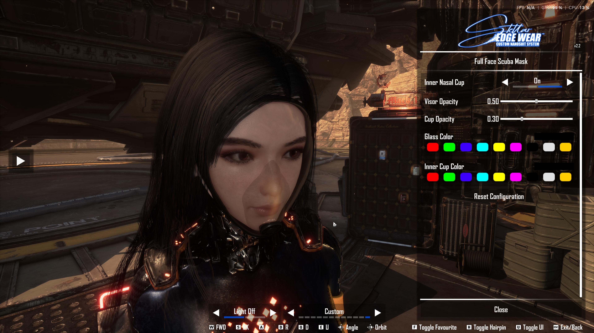
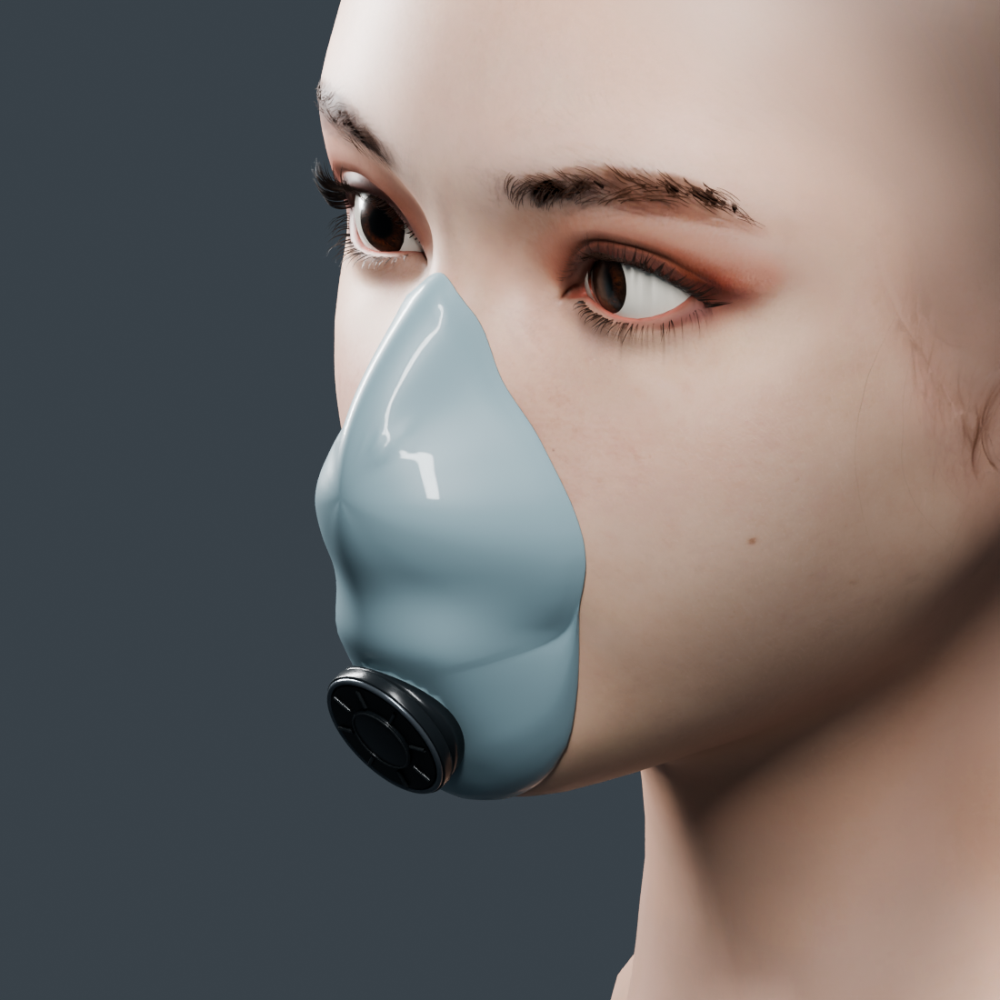

# Full Face Scuba Mask



The supplied in-game screenshot shows **Glass Color**, **Inner Cup Color**, both opacity sliders and **Inner Nasal Cup** in CNS. It confirms that the controls are displayed; it does not establish every color/persistence interaction or fit during facial animation.

An original full-face mask accessory fitted for Eve in **Stellar Blade**, intended for use with CNS. This repository contains editable mask geometry and the export/build scripts. It does not include the game's character mesh, textures, original glasses mesh, or Unreal Engine.

Version **1.1.7** adds separate **Glass Color** and **Inner Cup Color** swatches and color pickers inside the CNS configuration menu. Colors are now chosen in these settings rows. The **Inner Nasal Cup** toggle and both opacity sliders are preserved. Default opacity remains 10% for the visor and 20% for the cup.

The geometry remains version **1.1.6**: a broad molded lower cup joins the chin valve through a short direct collar, with a fitted under-chin seal. All mesh, material and rig files are unchanged by the color-settings update.



This Blender diagnostic hides the outer mask and makes the cup opaque to show its fit. The [profile preview](media/cup-chin-profile.png) shows the underside wrap. The delivered cup remains transparent at the existing 20% default; lighting and appearance differ in game.

## Download and use

Download the complete **1.1.7** package from the [GitHub release](https://github.com/thunderrun/stellar-blade-full-face-scuba-mask/releases/tag/v1.1.7). The mod also has a [Nexus Mods page](https://www.nexusmods.com/stellarblade/mods/3872). For a new installation, install [Custom Nanosuit System 2.2](https://www.nexusmods.com/stellarblade/mods/1496) and its required UE4SS setup first.

With the game closed, extract the **1.1.7** package's `SB` folder into the `StellarBlade` directory and replace the mask files in `SB/Content/Paks/~mods/CustomNanosuitSystem/Cosmetics/CodexScubaMask/`. The full package includes the verified **1.1.6 PAK/UCAS/UTOC triple** and new color-control JSON. Existing 1.1.6 installations need only the new JSON; older geometry requires the complete package. Keep only one installed copy of this mask. Restart the game after installation.

Start the game, equip a vanilla pair of glasses to initialize Eve's Eyes component, then press **Alt+N**, select Eve and choose **Full Face Scuba Mask** in the glasses/Eyes category. Open the mask's **cog/configuration** menu. **Glass Color** changes the visor and **Inner Cup Color** changes the cup and its valve collar independently. Use the color swatches or open the color picker for a custom color. Each setting colors both sides of its surface together. The opaque frame and separate opacity settings stay unchanged. At low opacity, tints are subtle; increase the corresponding opacity to make them more visible. In-game lighting affects the result.

Open the item's **cog/configuration** controls. **Inner Nasal Cup** switches the cup On/Off (default On); **Visor Opacity** and **Cup Opacity** adjust transparency independently. The raw slider range is **0.00–1.00**, equivalent to **0–100%**, in 0.01 steps. Defaults are 0.10 and 0.20. Each slider changes both inside and outside surface opacity. Reflections and Fresnel effects are unchanged, so 0 does not necessarily remove every reflection; use the cup toggle to hide its geometry completely. After the initial configuration update/restart, slider adjustments need no file swaps. If the new controls are missing after restarting, reset only this mask through **Reset Configuration** in its configuration panel; this also resets its saved settings.

## Files

| Path | Purpose |
| --- | --- |
| `assets/full_face_mask.blend` | Editable mask components, optimized game mesh and one-bone rig; no game fitting references |
| `assets/SK_CodexScubaMask.fbx` | 48,394-triangle skeletal game mesh, centimetres, one `Root` bone |
| `assets/SK_CodexScubaMask.glb` | Portable mask preview/export, metres |
| `assets/material_spec.json` | Blender preview material values |
| `assets/asset_manifest.json` | Export dimensions/slot contract and external skeleton reference |
| `assets/export_validation.json` | Source inventory and FBX/GLB checks for the included exports |
| `assets/cup_fit_validation.json` | Historical 1.1.5 under-chin geometry report; does not validate the current collar |
| `assets/valve_connection_validation.json` | Historical 1.1.4 open-passage and valve-contact audit, bound to that source hash |
| `assets/under_chin_validation.json` | Historical 1.1.5 underside-contact and old-duct audit, bound to that source hash |
| `assets/integrated_cup_geometry_validation.json` | Current 1.1.6 geometry, collar dimensions, collision and preserved seal-point checks |
| `assets/integrated_cup_validation.json` | Current independent 17-check review, bound to source and validated FBX hashes |
| `scripts/export_mask.py` | Repeatable selection, export and validation |
| `cns/CodexCNS-ScubaMask.dekcns.json` | CNS registration, independent glass/cup color pickers, cup toggle and linked opacity sliders |
| `scripts/package_color_variants.py` | Historical 1.1.2 preset-only helper; incompatible with the current color-settings configuration |
| `ue/` | Text-only UE 4.26 import/cook recipe and game material parameter contract |

## Open or export the model

Tested with Blender **5.2.1**. Open `assets/full_face_mask.blend`. The visible `MASK` collection contains individually named editable components. The hidden `EXPORT` collection contains `SK_CodexScubaMask`, the optimized mesh used by the exporter. Both are rigidly weighted to the single `Root` bone.

Run from the repository directory with Blender on your `PATH`:

```powershell
blender --background --python scripts/export_mask.py
blender --background --python scripts/export_mask.py -- --validate-only
```

The first command regenerates FBX/GLB and verifies geometry positions, triangle counts, material order, cup-toggle section separation, Root weights/rest pose, opacity and absence of external image dependencies. It leaves the `.blend` unchanged. Export bytes can vary with exporter versions and file timestamps; geometry and rig checks are the reproducibility target.

The authoring components and optimized mesh are separate. Editing a visible component does **not** automatically update the optimized mesh: update `SK_CodexScubaMask` as part of your edit and adjust the triangle counts in `asset_manifest.json` when appropriate. Keep the armature object named `Armature`; preserve the rest transform, centimetre source coordinates and material order for game integration.

The cup, sealing lip and direct valve collar use material index **7** (`M_Scuba_NasalCup`, 16,948 triangles). The complete outer visor, including the lower faceplate, uses index **8** (`M_Scuba_Visor`, 11,450 triangles). Opaque sections 0-6 are unchanged. CNS hides section 7 directly; lowering glass opacity to zero is not the toggle mechanism. Cup Off leaves 31,446 exterior triangles, including the enlarged faceplate aperture concealed beneath the valve.

The editable source contains `10 | Under-chin cup with directly molded valve collar` and `08 | Continuous outer visor with valve port`. The authored cup and visor match their optimized game sections. The broad lower chamber connects directly through a short 18 mm inner / 20 mm outer diameter collar; the old exposed vertical stem is removed. The concealed faceplate aperture has a 10.7 mm radius. All 39 lower seal points are unchanged from 1.1.5 and sit **0.45 mm** from the neutral reference skin. These are artistic fit measurements for a game asset.

## Build the game accessory

See [the UE build instructions](ue/README.md). You need your own installation of Unreal Engine **4.26.2**, Stellar Blade, and CNS. The project generates local placeholders at the game's required skeleton/material paths, but excludes those placeholders from the selected custom chunk. Only text/code is checked into `ue/`; no generated engine or game assets are included here.

CNS `VectorControls` exposes **Glass Color** on material slot **8** and **Inner Cup Color** on slot **7**. Each visible control writes `GlassColor Out`; its hidden `GlassColor In` partner uses `ControlledBy` to match it. Both use global parameters, layer index -1, RGB sliders from 0 to 1, and a hidden alpha fixed at 1. The neutral defaults match the cooked shader: `[0.12, 0.12, 0.12, 1]` for glass and `[0.18, 0.18, 0.18, 1]` for the cup. The old `OutfitDatas` color presets are removed so they do not compete with saved color settings. One original `OutfitPaths` entry and the existing `UniqueFitID` remain.

CNS `ScalarControls` links each hidden `Opacity Inner` control to its visible `Opacity Out` control through `ControlledBy`. Opacity defaults and the cup toggle are unchanged. This 1.1.7 configuration update needs no mesh or material recook; it uses the verified 1.1.6 geometry. See the [CNS advanced configuration schema](https://github.com/Dekita/SB-CustomNanosuitSystem-Docs/blob/main/guides/cns-json-advanced.md). Blender/glTF previews approximate the game shader and may look different under different lighting.

## Package the geometry update

Build and inspect the custom chunk using [the UE recipe](ue/README.md). Package only the selected chunk's three archives, renamed to the matching `CodexCNS-ScubaMask-947.pak/.utoc/.ucas` basenames, plus the current `cns/CodexCNS-ScubaMask.dekcns.json`. Retain the item ID and existing opacity/toggle definitions when extending the configuration. For the 1.1.7 release, reuse the verified 1.1.6 binary triple and replace only the JSON on an existing 1.1.6 installation.

`scripts/package_color_variants.py` remains a historical **1.1.2 preset-only** helper using old archives and configuration checks. Do not use it for the current release. `scripts/export_mask.py` accepts `--manifest` for validating an isolated draft against its own manifest before updating the source tree.

## Scope and verification

The mask-only source now has a broad lower chamber molded into a short direct valve collar. Every triangle coordinate and material assignment in opaque sections 0-6 is preserved. The upper cup and all 39 under-chin seal points remain exact; the old vertical duct is replaced and visor changes are confined to the concealed valve aperture. The Root rig and all nine material definitions are unchanged. The source is free of character meshes, images, linked libraries and text blocks. The private Eve reference used for fitting is not included.

Source and independent checks report a closed manifold cup, no cup/skin, cup/visor or cup/outer-seal triangle intersections, no nonadjacent self-intersections, and a closed manifold visor. The 17-check review confirms the broad lower chamber, open direct collar, removal of the old exposed stem, retained underside contact, and visor changes confined beneath the existing valve. Export checks verify all 48,394 triangles, material order, rigid Root weights and FBX roundtrip geometry. The shape is fitted to Eve's **neutral pose**: facial animation, other heads and extreme poses still require in-game inspection. The existing attachment follows the glasses Root bone and does not deform with facial expressions.

The design uses a compact nose-and-mouth pocket, a lower chin skirt and a broad lower chamber with a direct valve collar. The chin section is informed by the distinction between the breathing cup and flexible chin seal in [Avon's modular respirator design](https://patents.google.com/patent/WO2024074487A1/en). The original full-face arrangement was informed by [Ocean Reef's inner-pocket design](https://diving.oceanreefgroup.com/full-face-masks/) and [Interspiro's contoured face sealing](https://interspiro.com/en-gb/products/divator-full-face-mask?VariantID=VO62.VO64.VO36).

See [provenance and dependencies](ATTRIBUTION.md). No project license has been selected yet.
