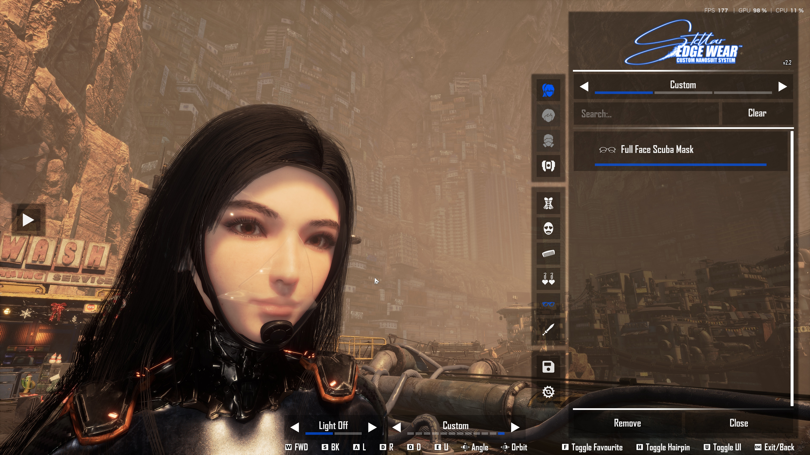

# Full Face Scuba Mask



An original full-face mask accessory fitted for Eve in **Stellar Blade**, intended for use with CNS. This repository contains editable mask geometry and the export/build scripts. It does not include the game's character mesh, textures, original glasses mesh, or Unreal Engine.

The revision 8 design has a black frame, an under-chin silicone seal, a clear integrated nasal cup/lower faceplate, and an opaque chin valve aligned to the faceplate. There are no inner valves, head straps, hose, snorkel or logos. Outer visor opacity is **10%**; nasal cup opacity is **20%**.

## Download and use

Download the ready-to-install mod from [Nexus Mods](https://www.nexusmods.com/stellarblade/mods/3872). Install [Custom Nanosuit System](https://www.nexusmods.com/stellarblade/mods/1496) first. With the game closed, copy the archive's four mod files into `StellarBlade/SB/Content/Paks/~mods/CustomNanosuitSystem/Cosmetics/CodexScubaMask/`.

Start the game, equip a vanilla pair of glasses to initialize Eve's Eyes component, then press **Alt+N**, select Eve and choose **Full Face Scuba Mask** in the glasses/Eyes category. It uses the same component as other glasses accessories.

## Files

| Path | Purpose |
| --- | --- |
| `assets/full_face_mask.blend` | Editable mask components, optimized game mesh and one-bone rig; no game fitting references |
| `assets/SK_CodexScubaMask.fbx` | 38,966-triangle skeletal game mesh, centimetres, one `Root` bone |
| `assets/SK_CodexScubaMask.glb` | Portable mask preview/export, metres |
| `assets/material_spec.json` | Blender preview material values |
| `assets/asset_manifest.json` | Export dimensions/slot contract and external skeleton reference |
| `assets/export_validation.json` | Source inventory and FBX/GLB checks for the included exports |
| `scripts/export_mask.py` | Repeatable selection, export and validation |
| `cns/CodexCNS-ScubaMask.dekcns.json` | Custom-authored CNS accessory registration |
| `ue/` | Text-only UE 4.26 import/cook recipe and game material parameter contract |

## Open or export the model

Tested with Blender **5.2.1**. Open `assets/full_face_mask.blend`. The visible `MASK` collection contains individually named editable components. The hidden `EXPORT` collection contains `SK_CodexScubaMask`, the optimized mesh used by the exporter. Both are rigidly weighted to the single `Root` bone.

Run from the repository directory with Blender on your `PATH`:

```powershell
blender --background --python scripts/export_mask.py
blender --background --python scripts/export_mask.py -- --validate-only
```

The first command regenerates FBX/GLB and verifies geometry positions, triangle count, material order, Root weights/rest pose, opacity and absence of external image dependencies. It leaves the `.blend` unchanged. Export bytes can vary with exporter versions and file timestamps; geometry and rig checks are the reproducibility target.

The authoring components and optimized mesh are separate. Editing a visible component does **not** automatically update the optimized mesh: update `SK_CodexScubaMask` as part of your edit and adjust the triangle count in `asset_manifest.json` when appropriate. Keep the armature object named `Armature`; preserve the rest transform, centimetre source coordinates and material order for game integration.

## Build the game accessory

See [the UE build instructions](ue/README.md). You need your own installation of Unreal Engine **4.26.2**, Stellar Blade, and CNS. The project generates local placeholders at the game's required skeleton/material paths, but excludes those placeholders from the selected custom chunk. Only text/code is checked into `ue/`; no generated engine or game assets are included here.

Game shader opacity uses separate inner/outer scalar parameters. `ue/manifest.json` sets both visor values to `0.10` and both nasal cup values to `0.20`. Blender/glTF previews approximate that shader and may look different under different lighting.

## Scope and verification

The included mask-only source is geometrically identical to the final fitted revision 8 model. Its fitting reference was deliberately removed for distribution. The original local fit/audit checked the neutral face pose and under-chin placement; this repository cannot rerun character-clearance tests without a separately obtained local reference. Facial animation, alternate heads and extreme poses can change clearance.

See [provenance and dependencies](ATTRIBUTION.md). No project license has been selected yet.
