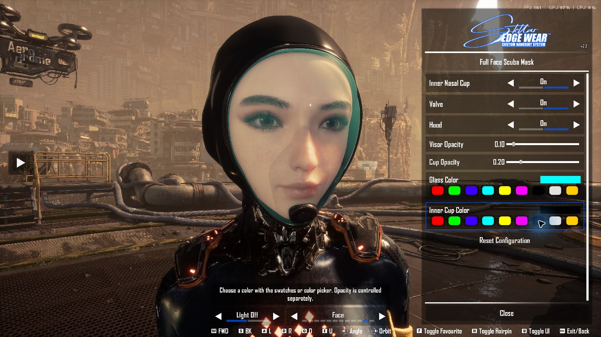
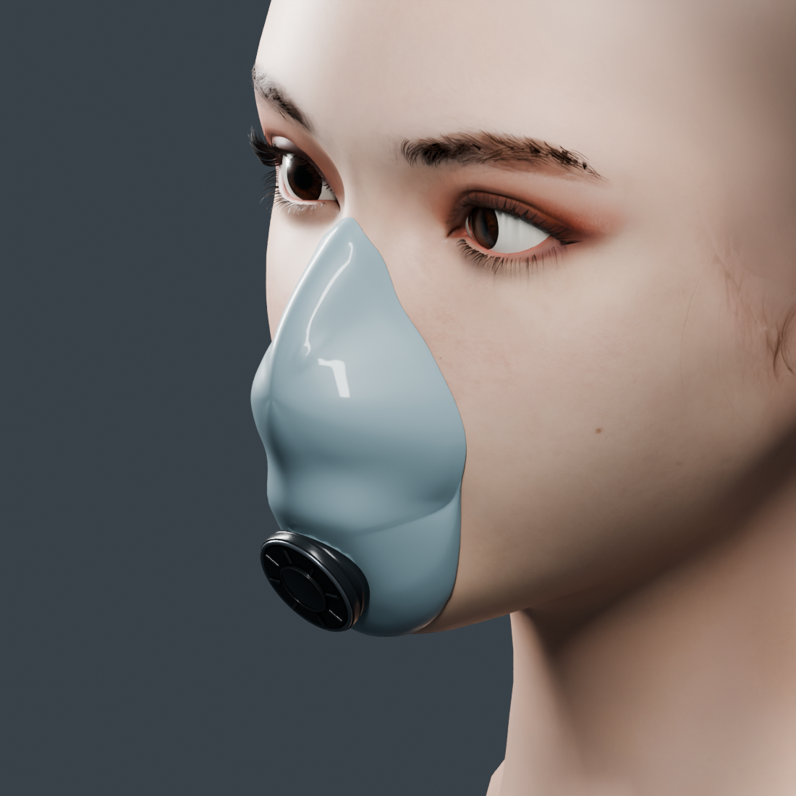

# Full Face Scuba Mask



The in-game screenshot shows **Inner Nasal Cup**, **Valve** and **Hood** enabled, with the color and opacity controls visible. Hair was temporarily hidden through CNS to inspect hood coverage; the mod itself leaves hair unchanged. The live checks described below were performed in **Stellar Blade 2.1 with CNS 2.2**.

An original full-face mask accessory fitted for Eve in **Stellar Blade**, intended for use with CNS. This repository contains editable mask geometry and the export/build scripts. It does not include the game's character mesh, textures, original glasses mesh, or Unreal Engine.

Version **1.1.9** adds an optional glossy black latex scuba **Hood** in CNS, defaulting to **Off**. It covers the scalp, ears, sides and back of the head, continues beneath the chin, and ends in a short neck cuff. Its face opening sits beneath the existing mask seal. Hair is untouched. The existing **Valve**, **Inner Nasal Cup**, **Glass Color**, **Inner Cup Color** and opacity settings are preserved. Valve and cup default to On; visor and cup opacity remain 10% and 20%.

The mask retains the **1.1.6** shape and **1.1.8** valve-section layout. Its **48,394 triangles and material slots 0–10** are unchanged. The hood adds **49,404 triangles** in slot **11** (`M_Scuba_LatexHood`), bringing the full mesh to **97,798 triangles and 12 material slots**. It shares the mask's rigid single-Root attachment. Turning Valve Off still leaves the cup collar and the visor's existing valve opening in place.



This Blender diagnostic hides the outer mask and makes the cup opaque to show its fit. The [profile preview](media/cup-chin-profile.png) shows the underside wrap. The delivered cup remains transparent at the existing 20% default; lighting and appearance differ in game.

## Download and use

Get the complete **1.1.9** package from the [GitHub release](https://github.com/thunderrun/stellar-blade-full-face-scuba-mask/releases/tag/v1.1.9). It includes the optional Hood and Valve controls, with the existing cup, color and opacity settings preserved. The [Nexus Mods page](https://www.nexusmods.com/stellarblade/mods/3872) has not been updated. For a new installation, install [Custom Nanosuit System 2.2](https://www.nexusmods.com/stellarblade/mods/1496) and its required UE4SS setup first.

With the game closed, extract the **1.1.9** package's `SB` folder into the `StellarBlade` directory. Replace all four mask files in `SB/Content/Paks/~mods/CustomNanosuitSystem/Cosmetics/CodexScubaMask/`. The rebuilt PAK/UCAS/UTOC triple and current JSON must be installed together; a JSON-only update cannot add the hood mesh and material. You can rebuild the package using the [UE recipe](ue/README.md). Keep only one installed copy of this mask. Restart the game after installation.

Start the game, equip a vanilla pair of glasses to initialize Eve's Eyes component, then press **Alt+N**, select Eve and choose **Full Face Scuba Mask** in the glasses/Eyes category. Open the mask's **cog/configuration** menu. **Glass Color** changes the visor and **Inner Cup Color** changes the cup and its valve collar independently. Use the color swatches or open the color picker for a custom color. Each setting colors both sides of its surface together. The opaque frame and separate opacity settings stay unchanged. At low opacity, tints are subtle; increase the corresponding opacity to make them more visible. In-game lighting affects the result.

Open the item's **cog/configuration** controls. With 1.1.9 installed, **Hood** switches the latex hood On/Off (default Off), **Valve** switches the exterior chin valve assembly On/Off (default On), and **Inner Nasal Cup** independently switches the cup and its collar On/Off (default On). **Visor Opacity** and **Cup Opacity** adjust transparency independently. The raw slider range is **0.00–1.00**, equivalent to **0–100%**, in 0.01 steps. Defaults are 0.10 and 0.20. Each slider changes both inside and outside surface opacity. Reflections and Fresnel effects are unchanged, so 0 does not necessarily remove every reflection; use the cup toggle to hide its geometry completely. After the initial configuration update/restart, slider adjustments need no file swaps. If the new controls are missing after restarting, reset only this mask through **Reset Configuration** in its configuration panel; this also resets its saved settings.

## Files

| Path | Purpose |
| --- | --- |
| `assets/full_face_mask.blend` | Editable mask and hood components, optimized game mesh and one-bone rig; no game fitting references |
| `assets/SK_CodexScubaMask.fbx` | 97,798-triangle skeletal game mesh, centimetres, one `Root` bone |
| `assets/SK_CodexScubaMask.glb` | Portable mask preview/export, metres |
| `assets/material_spec.json` | Blender preview material values |
| `assets/asset_manifest.json` | Export dimensions/slot contract and external skeleton reference |
| `assets/export_validation.json` | Source inventory and FBX/GLB checks for the included exports |
| `assets/valve_toggle_validation.json` | Historical 1.1.8 valve-section mapping and preservation checks, bound to that source/export revision |
| `assets/hood_validation.json` | 1.1.9 hood topology, neutral fitting and preservation of the existing mask |
| `assets/runtime_validation.json` | Stellar Blade 2.1 / CNS 2.2 live controls, coverage and full-restart persistence checks |
| `assets/cup_fit_validation.json` | Historical 1.1.5 under-chin geometry report; does not validate the current collar |
| `assets/valve_connection_validation.json` | Historical 1.1.4 open-passage and valve-contact audit, bound to that source hash |
| `assets/under_chin_validation.json` | Historical 1.1.5 underside-contact and old-duct audit, bound to that source hash |
| `assets/integrated_cup_geometry_validation.json` | Historical 1.1.6 geometry, collar dimensions, collision and preserved seal-point checks, bound to that source hash |
| `assets/integrated_cup_validation.json` | Historical independent 1.1.6 17-check review, bound to its source and validated FBX hashes |
| `scripts/export_mask.py` | Repeatable selection, export and validation |
| `cns/CodexCNS-ScubaMask.dekcns.json` | CNS registration, independent glass/cup color pickers, Hood/Valve/Inner Nasal Cup toggles, and linked opacity sliders |
| `scripts/package_color_variants.py` | Historical 1.1.2 preset-only helper; incompatible with the current color-settings configuration |
| `ue/` | Text-only UE 4.26 import/cook recipe and game material parameter contract |

## Open or export the model

Tested with Blender **5.2.1**. Open `assets/full_face_mask.blend`. The visible `MASK` collection contains individually named editable components. The hidden `EXPORT` collection contains `SK_CodexScubaMask`, the optimized mesh used by the exporter. Both are rigidly weighted to the single `Root` bone.

Run from the repository directory with Blender on your `PATH`:

```powershell
blender --background --python scripts/export_mask.py
blender --background --python scripts/export_mask.py -- --validate-only
```

The first command regenerates FBX/GLB and verifies geometry positions, triangle counts, material order, cup/valve/hood section separation, Root weights/rest pose, opacity and absence of external image dependencies. It leaves the `.blend` unchanged. Export bytes can vary with exporter versions and file timestamps; geometry and rig checks are the reproducibility target.

The authoring components and optimized mesh are separate. Editing a visible component does **not** automatically update the optimized mesh: update `SK_CodexScubaMask` as part of your edit and adjust the triangle counts in `asset_manifest.json` when appropriate. Keep the armature object named `Armature`; preserve the rest transform, centimetre source coordinates and material order for game integration.

The cup, sealing lip and direct valve collar use material index **7** (`M_Scuba_NasalCup`, 16,948 triangles). The complete outer visor, including the lower faceplate, uses index **8** (`M_Scuba_Visor`, 11,450 triangles). Slot **9** duplicates the accent material and slot **10** duplicates the vent material for the valve's portions of those formerly shared sections. Together with valve-only slots **1** and **4**, these sections form the independently hideable exterior valve. CNS hides cup section 7 directly. With Hood Off, Cup Off leaves 31,446 exterior triangles, Valve Off leaves 43,328, and hiding both cup and valve leaves 26,380. Turning Hood On adds its 49,404 triangles to each configuration. The valve aperture is concealed when the valve is On and remains when it is Off.

The hood is authored as `23 | Fitted glossy latex scuba hood` and uses only slot **11** (`M_Scuba_LatexHood`). Its thin closed shell has a face opening beneath the mask and a short neck opening, with joined inner and outer surfaces around both edges. It does not change the mask's geometry, material definitions or rig. The hood and mask are both rigidly weighted to `Root`. The short cuff limits extension onto the moving neck, but it does not deform with the neck or facial expressions; large neck motions and combat animation remain unvalidated.

The editable source contains `10 | Under-chin cup with directly molded valve collar` and `08 | Continuous outer visor with valve port`. The authored cup and visor match their optimized game sections. The broad lower chamber connects directly through a short 18 mm inner / 20 mm outer diameter collar; the old exposed vertical stem is removed. The concealed faceplate aperture has a 10.7 mm radius. All 39 lower seal points are unchanged from 1.1.5 and sit **0.45 mm** from the neutral reference skin. These are artistic fit measurements for a game asset.

## Build the game accessory

See [the UE build instructions](ue/README.md). You need your own installation of Unreal Engine **4.26.2**, Stellar Blade, and CNS. The project generates local placeholders at the game's required skeleton/material paths, but excludes those placeholders from the selected custom chunk. Only text/code is checked into `ue/`; no generated engine or game assets are included here.

CNS `VectorControls` exposes **Glass Color** on material slot **8** and **Inner Cup Color** on slot **7**. Each visible control writes `GlassColor Out`; its hidden `GlassColor In` partner uses `ControlledBy` to match it. Both use global parameters, layer index -1, RGB sliders from 0 to 1, and a hidden alpha fixed at 1. The neutral defaults match the cooked shader: `[0.12, 0.12, 0.12, 1]` for glass and `[0.18, 0.18, 0.18, 1]` for the cup. The old `OutfitDatas` color presets are removed so they do not compete with saved color settings. One original `OutfitPaths` entry and the existing `UniqueFitID` remain.

CNS `ScalarControls` links each hidden `Opacity Inner` control to its visible `Opacity Out` control through `ControlledBy`. Opacity defaults and the cup toggle are unchanged. The **Valve** control links mesh sections **1, 4, 9 and 10** through `ControlledBy` so a single visible setting switches the entire exterior valve assembly. **Hood** independently hides or shows section **11** and defaults to Off. Version 1.1.9 requires an FBX export, reimport and recook to supply all **12 material sections**. See the [CNS advanced configuration schema](https://github.com/Dekita/SB-CustomNanosuitSystem-Docs/blob/main/guides/cns-json-advanced.md). Blender/glTF previews approximate the game shader and may look different under different lighting.

## Package the geometry update

Build and inspect the custom chunk using [the UE recipe](ue/README.md). Package only the selected chunk's three archives, renamed to the matching `CodexCNS-ScubaMask-947.pak/.utoc/.ucas` basenames, plus the current `cns/CodexCNS-ScubaMask.dekcns.json`. Retain the item ID and existing color/opacity/cup/valve definitions when extending the configuration. For 1.1.9, install the rebuilt binary triple and current JSON together; previous binaries lack the hood in section 11. The 1.1.9 package passed build and cooked-asset checks, and the installed file hashes match its verified payload.

`scripts/package_color_variants.py` remains a historical **1.1.2 preset-only** helper using old archives and configuration checks. Do not use it for the current release. `scripts/export_mask.py` accepts `--manifest` for validating an isolated draft against its own manifest before updating the source tree.

## Scope and verification

Version 1.1.9 adds the optional hood to the existing accessory. Every original mask section 0–10 retains its triangle coordinates, corner normals, UVs, Root weights and material definitions. The hood adds 49,404 triangles in section 11; the complete asset has 97,798 triangles and 12 material slots. Source metadata and export hashes change with this revision. The private Eve reference used for fitting is not included, and hair is neither modified nor hidden.

The retained 1.1.6 and 1.1.8 reports remain historical evidence for their source/export/build hashes. Independent checks of the final 1.1.9 source confirm exact preservation of the original mask and rig, a single closed manifold hood with consistent winding, no degenerate triangles, and no detected hood/skin or nonadjacent self-intersections against the private neutral head reference. Its geometry matches the approved candidate inspected in glossy and matte Blender views for scalp, ear, side, back and under-chin coverage and the face opening beneath the mask. Source/export validation passed for all 97,798 triangles, 12 material slots, FBX roundtrip and rigid Root weights. Native container integrity, cooked geometry/connectivity and skeleton/material-reference checks also passed. The installation receipt records matching payload hashes and unchanged saved settings at installation.

Live tests in **Stellar Blade 2.1 with CNS 2.2** confirmed independent **Inner Nasal Cup**, **Valve** and **Hood** On/Off controls, visor opacity changing **0.10 → 0.99 → 0.10**, independent cyan visor/yellow cup color presets, and normal rendering. Hood coverage across the crown, ears, sides and rear was inspected with hair temporarily hidden in CNS; the mod leaves hair unchanged. A full game close and relaunch, followed by loading the existing camp save, retained **Hood On, Valve Off, Cup Off, cyan visor, black cup, visor opacity 0.10 and cup opacity 0.20**. See the [runtime validation report](assets/runtime_validation.json).

Testing was limited to a short camp/idle inspection and restart persistence. Broad combat movement, other heads and extreme poses remain untested. The accessory follows the rigid glasses Root attachment, so the short neck cuff does not deform with neck motion or facial expressions.

The design uses a compact nose-and-mouth pocket, a lower chin skirt and a broad lower chamber with a direct valve collar. The chin section is informed by the distinction between the breathing cup and flexible chin seal in [Avon's modular respirator design](https://patents.google.com/patent/WO2024074487A1/en). The original full-face arrangement was informed by [Ocean Reef's inner-pocket design](https://diving.oceanreefgroup.com/full-face-masks/) and [Interspiro's contoured face sealing](https://interspiro.com/en-gb/products/divator-full-face-mask?VariantID=VO62.VO64.VO36).

See [provenance and dependencies](ATTRIBUTION.md). No project license has been selected yet.
