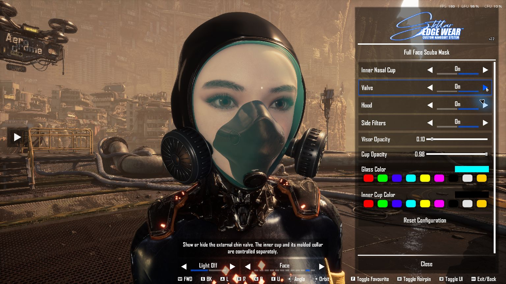

# Full Face Scuba Mask



This **1.2.0** in-game screenshot shows the larger cup and its two inlet valves, with Side Filters, Valve and Hood enabled. The mod leaves hair unchanged.

An original, strapless full-face mask accessory fitted for Eve in **Stellar Blade**, for use with CNS. This repository contains editable geometry and export/build scripts. It does not include the game's character mesh, textures, original glasses mesh, or Unreal Engine.

Version **1.2.0** adds optional paired **Side Filters** and two selectable cup variants: **Scuba cup** preserves the original cup, while **Large oral-nasal cup** broadens its cheek and nose coverage and includes **two small inlet valves on the inner cup**. Those inlet valves share the cup's material, color, opacity and visibility. The larger cup retains the original lower seal and molded chin-valve collar. Side Filters defaults to **Off** and remains independent of the cup and chin Valve. The oval visor, strapless frame, optional latex hood, colors and opacity controls remain available in both variants.

Both variants use **14 material slots**. The Scuba cup mesh has **107,302 triangles**, including 9,504 optional filter triangles appended to the previous 97,798-triangle asset. Its original sections 0–11 are preserved. The larger variant has **113,702 triangles** and changes only cup section 7: the 16,948-triangle broad cup plus 6,400 triangles for its two inlet-valve assemblies. Both retain the single-Root glasses attachment. Hair is untouched.

## Download and use

Download the [**1.2.0 package**](https://github.com/thunderrun/stellar-blade-full-face-scuba-mask/releases/download/v1.2.0/Full-Face-Scuba-Mask-CNS-Gas-Mask-Options-1.2.0.zip) or read its [release notes](https://github.com/thunderrun/stellar-blade-full-face-scuba-mask/releases/tag/v1.2.0). The [Nexus Mods page](https://www.nexusmods.com/stellarblade/mods/3872) has not been updated. Install [Custom Nanosuit System 2.2](https://www.nexusmods.com/stellarblade/mods/1496) and its required UE4SS setup first.

With the game closed, extract the complete package's `SB` folder into the `StellarBlade` directory. Replace all four mask files in `SB/Content/Paks/~mods/CustomNanosuitSystem/Cosmetics/CodexScubaMask/`. Install the matching PAK/UCAS/UTOC triple and current JSON together. A JSON-only update cannot add the side hardware or second mesh. Keep only one installed copy and restart the game after installation. To build from source, follow the [UE recipe](ue/README.md).

Equip a vanilla pair of glasses to initialize Eve's Eyes component, press **Alt+N**, select Eve and choose **Full Face Scuba Mask** in the glasses/Eyes category. Use the item's variant arrows to select **Scuba cup** or **Large oral-nasal cup**. Open its **cog/configuration** menu for independent settings:

| Setting | Effect | Default |
| --- | --- | --- |
| Inner Nasal Cup | Shows the selected cup, its collar and the larger cup's inlet valves | On |
| Valve | Shows the exterior chin valve assembly | On |
| Hood | Shows the glossy black latex hood | Off |
| Side Filters | Shows both lower side filters together | Off |
| Glass Color / Inner Cup Color | Colors the visor and cup independently | Neutral glass / cup |
| Visor Opacity / Cup Opacity | Adjusts each surface independently | 0.10 / 0.20 |

Use the color swatches or picker for custom colors. Each setting colors both sides of its surface together. At low opacity, tints are subtle; increase the corresponding opacity to make them more visible. The opacity range is **0.00–1.00** in 0.01 steps. Reflections and Fresnel effects remain, so zero opacity need not remove every reflection; use the cup toggle to hide its geometry completely. Turning Valve Off leaves the cup collar and the visor's existing valve opening in place.

If new controls are missing after restarting, reset only this mask through **Reset Configuration** in its configuration panel; this also resets its saved settings.

The hood covers the scalp, ears, sides and back of the head, continues beneath the chin, and ends in a short neck cuff. Its face opening sits beneath the mask seal. The cuff follows the rigid head attachment and does not deform with neck motion or facial expressions.

## Files

| Path | Purpose |
| --- | --- |
| `assets/full_face_mask.blend` | Editable components, two optimized game meshes and one-bone rig; no game fitting references |
| `assets/SK_CodexScubaMask.fbx` / `.glb` | Scuba cup variant; FBX uses centimetres and GLB uses metres |
| `assets/SK_CodexGasMask.fbx` / `.glb` | Large oral-nasal cup variant with the same material and rig contract |
| `assets/asset_manifest.json` | Scuba export contract and additional variant registration |
| `assets/gasmask_variant_manifest.json` | Large cup export contract |
| `assets/material_spec.json` | Blender preview material values |
| `assets/export_validation.json` | Main source inventory and FBX/GLB checks |
| `assets/gasmask_export_validation.json` | Large-cup source inventory and FBX/GLB checks |
| `assets/gas_mask_variant_validation.json` | 1.2.0 source, fitting and preservation report |
| `assets/gas_mask_runtime_validation.json` | 1.2.0 live variant, controls and restart-persistence checks |
| `assets/hood_validation.json` | Historical 1.1.9 hood topology, neutral fitting and mask preservation |
| `assets/runtime_validation.json` | Historical 1.1.9 live controls, coverage and restart persistence |
| `assets/valve_toggle_validation.json` | Historical 1.1.8 valve-section checks |
| `assets/cup_fit_validation.json` / `under_chin_validation.json` | Historical 1.1.5 fitting and underside reports |
| `assets/valve_connection_validation.json` | Historical 1.1.4 passage/contact report |
| `assets/integrated_cup_geometry_validation.json` / `integrated_cup_validation.json` | Historical 1.1.6 geometry and independent 17-check review |
| `scripts/export_mask.py` | Repeatable export and validation of both mesh variants |
| `cns/CodexCNS-ScubaMask.dekcns.json` | CNS variants, independent toggles, colors and linked opacity sliders |
| `ue/` | UE 4.26 import/cook recipe and material parameter contract |

Historical reports validate only their recorded source/export hashes. They do not certify later geometry or runtime behavior.

## Open or export the model

Tested with Blender **5.2.1**. Open `assets/full_face_mask.blend`. Named visible components are editable; the hidden export meshes are `SK_CodexScubaMask` and `SK_CodexGasMask`. Both are rigidly weighted to the single `Root` bone.

Run from the repository directory with Blender on your `PATH`:

```powershell
blender --background --python scripts/export_mask.py
blender --background --python scripts/export_mask.py -- --validate-only
```

The exporter processes the main manifest and its additional variant. It verifies positions, triangle counts, material order, section separation, Root weights/rest pose, opacity and absence of external image dependencies. It leaves the `.blend` unchanged. Export bytes can vary with exporter versions and timestamps; geometry and rig checks are the reproducibility target.

Editing a visible component does **not** automatically update either optimized mesh. Update the appropriate export mesh and manifest together. Keep the armature named `Armature`; preserve the rest transform, centimetre coordinates and material order. The two variants must match exactly outside cup section 7.

| Section | Geometry | Scuba cup triangles | Large cup triangles |
| --- | --- | --- | --- |
| 0–10 | Mask, including the selected cup | 48,394 | 54,794 |
| 7, within the above total | Cup, seal and collar; large cup also includes inlet valves | 16,948 | 23,348 |
| 8, within the above total | Complete outer visor and lower faceplate | 11,450 | 11,450 |
| 1, 4, 9, 10, within the above total | Independently hideable chin valve | 5,066 | 5,066 |
| 11 | Latex hood | 49,404 | 49,404 |
| 12–13 | Paired side filter bodies and details | 9,504 | 9,504 |
| Total | All sections, including hidden options | 107,302 | 113,702 |

With Hood and Side Filters Off, the Scuba cup variant has 31,446 triangles with Cup Off, 43,328 with Valve Off, and 26,380 with both hidden. The larger variant adds its inlet-valve geometry to section 7, so Cup Off hides those valves together with the cup. Optional hood and filter sections add their listed counts independently. Hiding either cup must leave the outer visor closed.

The Scuba cup retains the broad lower chamber and short 18 mm inner / 20 mm outer diameter valve collar from 1.1.6. Its lower seal and collar also remain in the larger variant; enlargement is concentrated around the cheeks and nose. Two shallow round inlet-valve details sit on the larger cup's cheek wings, inside the visor, and belong to the same cup material section. They are present only with Large oral-nasal cup selected and visible. These are artistic fitting dimensions and details for a game asset.

## Build and package the game accessory

See [the UE build instructions](ue/README.md). You need your own Unreal Engine **4.26.2**, Stellar Blade and CNS installations. The build creates two skeletal meshes and 14 shared material instances: **16 custom asset packages** inside one selected PAK/UCAS/UTOC triple. Local placeholders for game dependencies are excluded from that chunk. No generated engine or game assets are included in `ue/`.

The two `OutfitPaths` and matching `OutfitNames` select the cup mesh while preserving the existing `UniqueFitID`. `VectorControls` exposes Glass Color on slot 8 and Inner Cup Color on slot 7. Each visible `GlassColor Out` writes its hidden `GlassColor In` partner through `ControlledBy`. Neutral RGBA defaults remain `[0.12, 0.12, 0.12, 1]` for glass and `[0.18, 0.18, 0.18, 1]` for the cup. Old color-preset `OutfitDatas` overrides remain absent.

Opacity controls link each hidden `Opacity Inner` to visible `Opacity Out`. Valve links sections 1, 4, 9 and 10; Hood controls 11; Side Filters links 12–13. Cup uses section 7 in either variant, including the inlet valves on the larger cup. See the [CNS advanced configuration schema](https://github.com/Dekita/SB-CustomNanosuitSystem-Docs/blob/main/guides/cns-json-advanced.md).

Inspect the selected chunk, then package its archives as `CodexCNS-ScubaMask-947.pak/.utoc/.ucas` with the current CNS JSON. Install all four together. Preserve the item ID and existing controls when extending the configuration. `scripts/package_color_variants.py` is a historical **1.1.2 preset-only** helper and is incompatible with this build. `scripts/export_mask.py --manifest` supports isolated draft validation.

## Scope and verification

**1.2.0, revision 16:** independent source checks passed preservation of the original mask, hood, filters, materials and rig, with the two variants differing only in cup section 7. The six new inlet parts—two seats, two thin flaps and two retaining posts—passed closed-component and self-intersection checks, with no detected intersections against the neutral skin, visor, hood or outer seal. Their minimum sampled visor clearance is approximately **0.562 mm**; contacts with the cup and between retaining posts/flaps are intentional. The original broad-cup geometry remains intact beneath the added details. The source inventory contains no images, text blocks or linked libraries. Both FBX/GLB exports passed geometry, section counts, material order, rigid Root weights and FBX roundtrip checks. Static visibility counts passed all 32 combinations across the two variants and four independent toggles. UE cooking, native container integrity and all six cooked-asset audits passed. The four locally installed files match the audited payload hashes. Static checks and installation readback are recorded separately from the live observations below.

Live **1.2.0 revision 16** checks in **Stellar Blade 2.1 with CNS 2.2** confirmed both named meshes render and **Large oral-nasal cup → Scuba cup → Large oral-nasal cup** switching works; the original Scuba cup has no inlet discs. **Side Filters On → Off → On** switches both filters while the cup and inlet valves remain visible. **Inner Nasal Cup Off** hides the larger cup and both inlet valves together. The exterior chin **Valve** can be hidden independently, and **Hood On**, independent cup/visor colors and both opacity sliders work.

A full process exit, relaunch and **Continue**, followed by CNS readback, retained **Large oral-nasal cup**, **Cup/Valve/Hood/Side Filters all On**, **cyan glass**, **black cup**, **visor opacity 0.10** and **cup opacity 0.98**. See the [1.2.0 runtime report](assets/gas_mask_runtime_validation.json). This inspection was limited to camp/idle and restart persistence; combat movement and extreme poses are not validated. After testing, the game was closed and the original saved CNS settings were restored byte-for-byte, verified by matching SHA-256 hashes.

**1.1.9 history:** every original mask section 0–10 retained coordinates, corner normals, UVs, Root weights and material definitions. Independent checks confirmed a closed manifold hood without detected skin or nonadjacent self-intersections against the private neutral head. Source/export validation passed for 97,798 triangles, 12 material slots, FBX roundtrip and rigid Root weights. Native container integrity, cooked geometry/connectivity and skeleton/material-reference checks passed. Its installation receipt records matching payload hashes and unchanged saved settings at installation.

Live **1.1.9** tests in **Stellar Blade 2.1 with CNS 2.2** confirmed independent Cup/Valve/Hood toggles, visor opacity **0.10 → 0.99 → 0.10**, independent cyan visor/yellow cup presets, normal rendering and crown/ear/side/rear hood coverage. Hair was temporarily hidden in CNS for inspection. A full game close and relaunch, followed by loading the existing camp save, retained **Hood On, Valve Off, Cup Off, cyan visor, black cup, visor opacity 0.10 and cup opacity 0.20**. See the [1.1.9 runtime report](assets/runtime_validation.json).

Testing was limited to camp/idle and restart persistence. Broad combat movement, other heads and extreme poses remain untested. The accessory retains its rigid glasses Root attachment; the short hood cuff does not deform with neck motion or facial expressions. The private Eve fitting reference is not included, and the mod neither modifies nor hides hair.

The original geometry draws design inspiration from the lateral filters and separate nose cup of [Dräger X-plore 5500](https://www.draeger.com/Content/Documents/Products/x-plore-5500-pi-DMC-113276-en-us.pdf), the panoramic visor and interchangeable nosecups of [Avon FM54](https://www.avon-protection.com/media/ue1iluwy/avon-protection_fm54-respirator_product-brochure_en.pdf), and the distinction between breathing cavity and flexible chin seal in [Avon's respirator patent](https://patents.google.com/patent/WO2024074487A1/en). No manufacturer model, texture or logo is included. See [provenance and dependencies](ATTRIBUTION.md). No project license has been selected yet.
